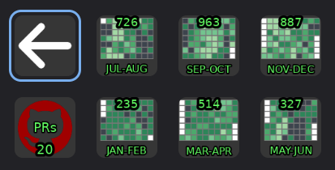

# GithubPlugin

## Index

- [Pre-Requirements](#pre-requirements)
- [Overview](#overview)
- [Example Screenshot](#example-screenshot)
- [FetchPullRequests.py](#fetchpullrequestspy)
  - [Features](#features)
  - [Configuration](#configuration)
  - [How It Works](#how-it-works)
- [Contributions.py](#contributionspy)
  - [Features](#features-1)
  - [Configuration](#configuration-1)
  - [How It Works](#how-it-works-1)
- [Usage](#usage)

---

## Pre-Requirements

- Before using this plugin, you must generate a GitHub [personal access token](https://github.com/settings/tokens).
- You can select the scopes you'd like to add—this token will be used for the **GitHub Access Token** field in the plugin settings.

---

## Overview

This plugin provides two main actions for integrating GitHub data into your [StreamController](https://streamcontroller.core447.com/) setup:

- **FetchPullRequests.py**: Displays pull request counts and statuses for a configured repository.
- **Contributions.py**: Visualizes user contribution activity over time.

---

## Example Screenshot

---

## FetchPullRequests.py

### Features

- Fetches and displays the number of open pull requests for a specified GitHub repository.
- Shows a colored icon indicating the status of the latest pull request checks (success, failure, cancelled, timed out, etc.).
- Provides quick access to the repository's pull requests page via keyboard shortcut.
- Periodically refreshes data based on a configurable interval.

### Configuration

- **GitHub Access Token**: Required for authenticated API requests. Generate a personal access token with appropriate scopes.
- **Repository URL**: The full URL of the GitHub repository (e.g., `https://github.com/owner/repo`).
- **Refresh Rate**: How often (in minutes) to update the pull request count and status. Set to `0` to disable auto-refresh.

### How It Works

1. **Initialization**: On startup, the action checks for a valid token and repository URL. If missing, it prompts for configuration.
2. **Fetching PRs**: Uses the GitHub API to retrieve open pull requests and displays the count.
3. **Status Icon**: For each PR, fetches the latest commit's check run status and sets the icon color accordingly:
   - Red: Failure
   - Yellow: Cancelled/Timed Out
   - Green: Success
   - Gray: No status
4. **UI Integration**: Provides configuration rows for token, repo URL, and refresh rate. Clicking or pressing a key can open the PRs page in a browser.
5. **Auto-Refresh**: Uses a timer to periodically update the display based on the configured refresh rate.

---

## Contributions.py

### Features

- Visualizes a user's GitHub contributions (commits, PRs, etc.) over time.
- Supports bimonthly display ranges.
- Customizable display options (show/hide top/bottom labels and select user).
- Periodic refresh to keep contribution data up-to-date.

### Configuration

- **GitHub Access Token**: Required for authenticated API requests.
- **GitHub Username**: The user whose contributions you want to display.
- **Refresh Rate**: How often (in minutes) to update the contributions data.
- **Display Options**: Toggle visibility of top/bottom labels, select display month, and more.

### How It Works

1. **Initialization**: Loads settings and prepares the UI for configuration.
2. **Fetching Contributions**: Uses the GitHub API to retrieve and process the user's contribution data.
3. **Visualization**: Renders a graphical representation of contributions, with color-coding and optional labels.
4. **Customization**: Offers UI controls for adjusting the display, including which month(s) to show and label visibility.
5. **Auto-Refresh**: Periodically updates the contribution graph based on the refresh rate.

---

## Usage

1. **Generate a GitHub personal access token**
   (You can allow only the scopes required for your query.)
2. **Configure the plugin**
   - Enter your token under "GitHub Access Token" in the settings.
   - For PullRequests, specify the repository URL.
   - For Contributions, specify the GitHub username.
3. **Adjust refresh rates and display options as desired.**

---
